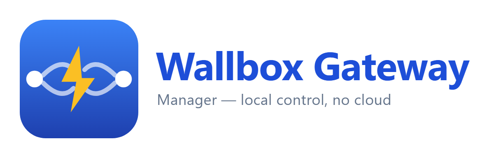

<p align="center">
  
</p>

# Wallbox BLE Gateway HA Add-on

Home Assistant Add-on for managing the
[ESP32 Wallbox BLE Gateway](https://github.com/botts7/esp32-wallbox).

## What it does

Adds a sidebar panel to Home Assistant for the gateway: live
charging state, controls (Start / Stop / Lock / Unlock / Max
current), connection health for BLE / WiFi / MQTT, and a
drag-and-drop OTA firmware upload. Same dark theme as the
gateway's own `/dashboard` — they're meant to feel like one
product.

It also surfaces the gateway's **schedule editor** + weekly
**schedule timeline**, an HA-style **Solar / Grid → Vehicle
energy-flow card**, and a **Sessions** page with a day×hour energy
heatmap and **schedule-aware electricity cost**: a time-of-use
**tariff editor** (named rate bands, NEM seasonal rates, and
effective-dates) bills each charge at the rate *and the time of day*
it actually happened — solar is free, only grid is billed, and a
night-shifted (off-peak) charge is no longer billed at the evening
peak. Cost stays accurate as your rates change over time.

The Add-on doesn't replace the MQTT discovery the gateway
already publishes — entities you've already set up keep working
as before. This is for HAOS / HA Supervised users who want a
sidebar panel for the gateway without leaving Home Assistant.

Roadmap:

- **v0.1.0** — read-only dashboard (status + health + diagnostics)
- **v0.2.0** — OTA firmware upload from inside HA
- **v0.3.0** — Supervisor ingress URL fix · redesigned dashboard
  (dark theme · hero card · stats grid) · controls (Start / Stop /
  Lock / Unlock / Max current) · power-meter values (mains V,
  house W)
- **v0.4.0** — recent-events sparkline + boot history surface
- **v0.5.0–v0.11.0** — schedule editor + weekly timeline · charger
  notifications · Power-Flow card · Sessions page (energy heatmap +
  CSV) · time-of-use tariff editor + NEM seasonal rates · control-owner
  banner
- **v0.21.0 (beta)** — schedule-aware cost: each charge is billed in
  the *real* charge window (via the gateway's `/api/charge_log`
  charge-interval capture), not at plug-in time · grid-only billing
  (solar free) + dollar savings · HA-style Solar/Grid energy-flow card ·
  week/month cost tiles · tariff **effective-dates** (past costs don't
  change when rates do) · next-charge in the nav bar · last-charge-burst
  readout
- **v1.0.0** — submit to community-hassio-addons for upstream
  store listing

## Installation

1. In Home Assistant, go to **Settings → Add-ons → Add-on Store**.
2. Open the three-dot menu (⋮) and choose **Repositories**.
3. Paste this repo's URL:
   ```
   https://github.com/botts7/wallbox-gateway-ha-addon
   ```
4. Reload the store and install **Wallbox BLE Gateway Manager**.
5. Open the Add-on's **Configuration** tab, set:
   - `gateway_ip` — local IP of the gateway (e.g. `192.168.1.42`)
   - `gateway_auth_user` / `gateway_auth_pass` — gateway web auth,
     if you enabled it. Leave blank if the gateway is open.
6. Start the Add-on. A "Wallbox Gateway" entry appears in the
   sidebar.

## Compatibility

- Home Assistant OS or HA Supervised. Add-ons don't run on the
  HA Container or Core installs.
- Gateway firmware **v3.0.0 or newer** (`/api/health` and the
  diagnostic endpoints landed in 3.0). The schedule-aware cost /
  energy-flow features need **v3.2.0+** (the `/api/charge_log`
  charge-interval capture); without it they fall back to schedule-
  inferred billing.

## Layout

```
wallbox-gateway-ha-addon/
├── repository.yaml          ← tells HA this is an Add-on repo
├── README.md
└── wallbox-gateway/         ← the Add-on
    ├── config.yaml          ← name, version, options, ingress
    ├── build.yaml           ← multi-arch base images
    ├── Dockerfile
    ├── rootfs/              ← copied into the image
    │   └── etc/services.d/wallbox/run
    └── app/                 ← Flask service
        ├── server.py
        ├── proxy.py
        ├── templates/
        └── static/
```

## Why Flask, not FastAPI

See the planning doc upstream — short version: 2026 Starlette
CVEs made FastAPI's dependency tree higher-churn than Flask's,
and our workload is small request/response with no async benefit.
